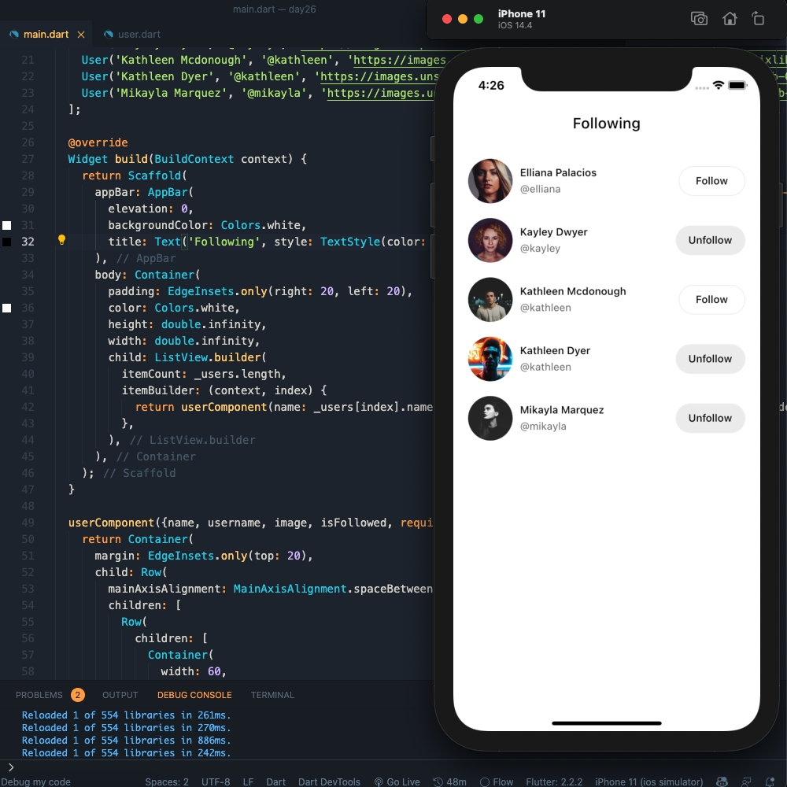
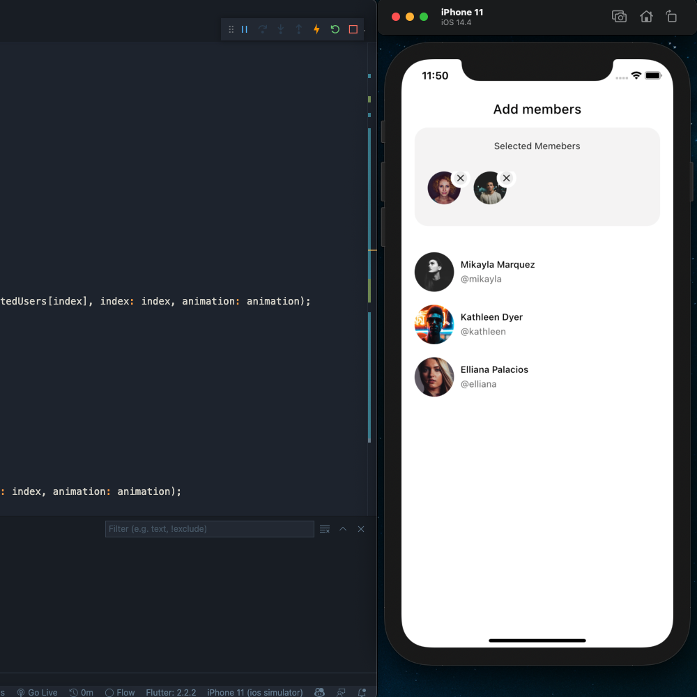

## Flutter Instagram Following List Redesign - Day 26/27

```dart
class Afgprogrammer extends Flutter100DaysOfCode {
  videos() {
    return [
      {
        "title": "Flutter Instagram Following List Redesign",
        "description": "Let's Redesign Instagram Following List with ListView widget",
        "day": 26,
        "videoLink": "https://youtu.be/A3iNuRhbwNg"
      },
      {
        "title": "Flutter Animation | Let's work with the AnimatedList Widget",
        "description": "Let's work with the AnimatedList widget and make our list view animated.",
        "day": 27,
        "videoLink": "https://youtu.be/6jJVGJgsyxY"
      },
    ]
  }
}
```
### [Watch it on Youtube (day 26)](https://youtu.be/A3iNuRhbwNg)
### [Watch it on Youtube (day 27)](https://youtu.be/6jJVGJgsyxY)

## Previous Designs
[Checkout my Youtube channel](https://youtube.com/afgprogrammer)


## Development Setup
Clone the repository and run the following commands:
```
flutter pub get
flutter run
```

## ScreenShot
### Following page


### Members page


## Links

* [Website](https://afgprogrammer.com)
* [Youtube channel](https://youtube.com/afgprogrammer)
* [Twitter](https://twitter.com/afgprogrammer)
* [Instagram](https://instagram.com/afgprogrammer)
